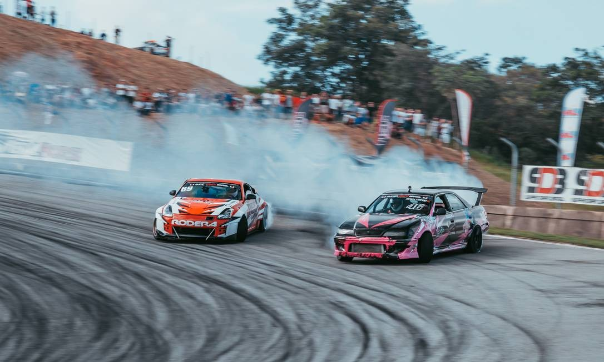
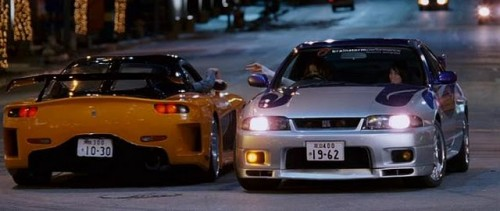
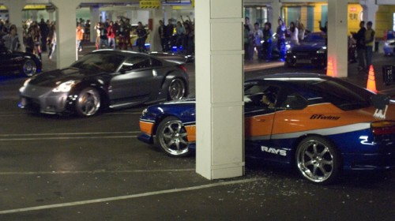
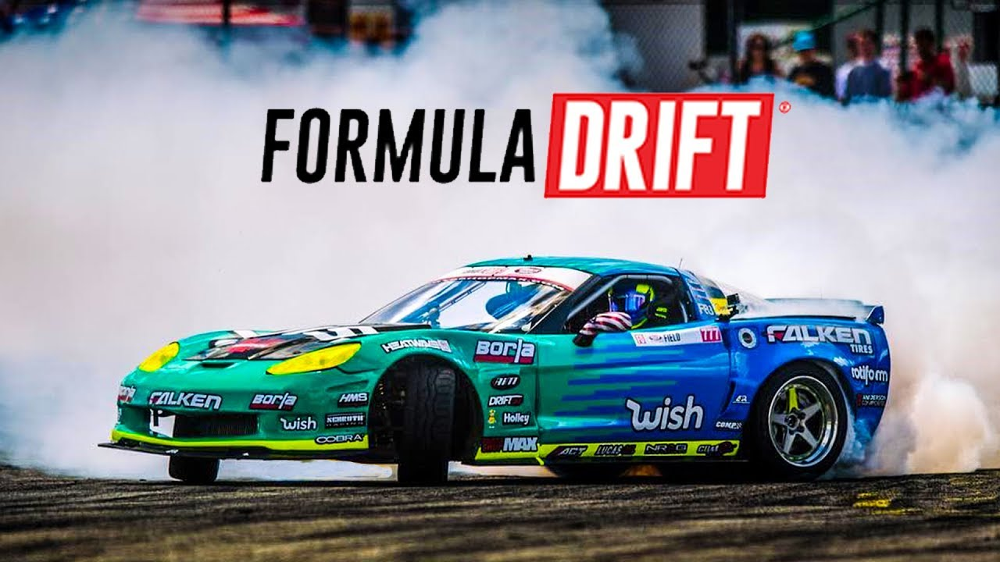
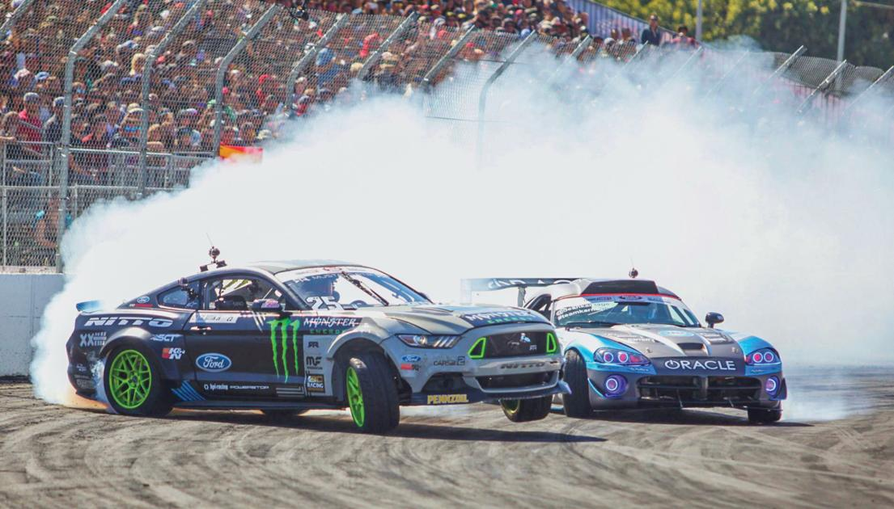

# Drift

Neste artigo você lerá sobre o Drift, além de:
+ Origem
+ Campeonatos
+ Carros usados
-----------

#### O que é drift?
_**Drift**_ ou _**Drifting**_ (ドリフト走行 dorifuto sōkō?), é uma técnica de direção de carros que consiste em deslizar nas curvas escapando a traseira, girar o volante para que as rodas dianteiras estejam sempre em uma direção oposta a curva (se o carro vira para a direita então a roda deve estar a esquerda, e vice versa), controlando o nível de derrapagem, fazendo o carro literalmente andar de lado.

------
### Origem do Drift

O drift moderno teve início no “All Japan Touring Car Championship races” há 48 anos atrás. O lendário piloto Kunimitsu Takahashi foi o criador da técnica em 1970. Ele ficou famoso batendo seu “apex” (o ponto onde o carro esta mais perto da curva) em alta velocidade e derrapando na curva, saindo da curva com mais velocidade que o normal. Depois dessa façanha ele ganhou uma legião de fãs que deram início ao drift japonês.

Um corredor de rua chamado Keiichi Tsuchiya ficou particularmente interessado no drift de Takahashi, Tsuchiya começou a praticar suas técnicas de drift nas montanhas do Japão, e rapidamente ganhou uma grande reputação. Em 1987, uma revista muito popular de tunning e carros concordou em produzir um vídeo sobre as habilidades de Tsuchiya, esse vídeo conhecido como Pluspy se tornou um hit e inspirou milhares de corredores profissionais de drift que correm nos circuitos atualmente. Em 1988 o diretor chefe da Option magazine Daijiro Inada ajudou a organizar o primeiro torneio especializado em drift.

O drift chegou ao Brasil em meados de 2006, mas só começou a se popularizar efetivamente e ganhar destaque no final de 2011 com o primeiro evento mensal promovido pela equipe DRIFT BR na Cidade de Itú, interior de SP, evento esse que foi de chamado Drift Day Soukoukai (nome também utilizado no japão para esse tipo de evento), sob o comando do Piloto, chefe de Equipe e organizador Sandro Freitas. No evento cada piloto ia com seu carro para a pista fechada para fazerem um verdadeiro show com os carros e ao mesmo tempo evoluir as técnicas do esporte. Atualmente o responsável pelo Drift no território Brasileiro é o Écio Moreira, que se encontra atualmente a tentar implementar um Campeonato nacional desta modalidade, participou no passado ano como responsável do martketing do CPD.

O lançamento do filme Velozes e Furiosos: Desafio em Tóquio também ajudou na divulgação da modalidade por todo o Brasil, tendo ,depois de sua estreia, vários documentários e matérias em jornais e revistas falanso sobre a modalidade. E, assim, logo vieram disputas e Campeonatos Regionais e Nacionais promovidos por algumas equipes.
> Cena Velozes e furiosos 3 

> Cena Velozes e furiosos 3 

Em 2017 ocorreu a primeira tentativa da FPAK (Federação Portuguesa de Automobilismo e Karting) de implementar em Portugal um campeonato federado de drift, sendo cancelado ao fim da terceira prova. Atualmente, em 2018, o CAM - Clube Automóvel do Minho, sob a égide da FPAK tornou-se o promotor do Campeonato de Portugal de Drift, havendo cinco provas em distintos pontos do país.

A primeira prova, organizada pelo próprio CAM, teve lugar em Guilhabreu no fim de semana de 2 e 3 de Junho, contando com mais de 30 pilotos inscritos nas 3 categorias (iniciados, semi Pro e Pro), esgotando a capacidade do circuito com a enorme afluência de público. Nesta prova o vencedor foi Diogo Correia, na categoria Pro.

A segunda prova, realizou-se em Pinhel, organizada pelo Clube Escape Livre, e contou com cerca de 40 pilotos inscritos. Durante o mês de Agosto, dias 22 e 23, onde sábado ocorreu no final do dia a Taça Internacional de Drift, inciativa do mesmo clube, onde 17 pilotos também se inscreveram. O vencedor deste fim de semana foi o jovem bracarense André Silva.

A terceira prova, a mais a sul do campeonato, contou com a organização do TVR - Associação Trial Voz de Reguengos e levou o drift ao alentejo à cidade de Reguengos de Monsaraz. Nesta prova com 32 inscritos, o vencedor foi Nelson Rocha.

As próximas paragens do campeonato serão Fatima em Outubro e em Novembro, ainda está por definir o local da prova que encerrá o mesmo.

-----

### Campeonatos oficiais conhecidos

##### Formula Drift 
A Fórmula D é uma categoria automobilística de drift dos Estados Unidos fundada em 2004, inspirada na D1 Grand Prix, esta que começou inicialmente no Japão, cuja inspiração teve inicio num piloto japonês, chamado Kunimitsu Takahashi, criador da técnica em 1970 e se expandiu por todo mundo.

O campeonato se espalhou pelo mundo e é o sonho de todo piloto de drift correr nesse campeonato, além de ter um reconhecimento enorme, os prêmios e os pilotos são de qualidade impecável.

##### Super Drift Brasil
O Super Drift Brasil é atualmente a maior competição de Drift da América Latina. Para atingir isso trabalhamos com muito esforço desde 2015 sempre prezando a qualidade e segurança.

O campeonato é guiado por regras rígidas feitas para garantir que a modalidade no país seja praticada com o mais alto nível exigindo o máximo de todos os competidores e seus veículos, mas sempre prezando a segurança de todos os envolvidos.

---

#### Carros

Os carros utilizados em drift são consideravelmente leves. No Japão os carros mais usados são o Nissan Silvia,Nissan 350z ou (zeto), Toyota AE86, Mazda RX-7, Nissan Cefiro (versão com tração traseira), Nissan Laurel, Nissan Skyline (com tração traseira), Nissan Fairlady Z, Toyota Altezza, Toyota Soarer, Honda S2000, Mazda Miata, Toyota Supra, Subaru Impreza e Mitsubishi Lancer Evolution. Já a competição de drift nos EUA utiliza versões locais desses carros (tais como Nissan 240SX e o Corolla GT-S de Toyota), carros americanos de alta desempenho Dodge Viper, e muscle cars como o Dodge Challenger ou o Ford Mustang. Os drifters em outros países geralmente usam seus carros locais, tais como o Ford Sierra (Ucrânia e Irlanda), BMW Série 3 (em outras partes da Europa), ou Volvos. Porém, não basta somente com que sejam carros a tracção traseira: A distribução de peso, e portanto, a posição do motor, fazem muito difíceis de dirigir num drift aqueles carros com motor central, como o Lotus Elise, ou traseiro, como o Porsche 911.

Os carros FWD (com tracção dianteira) não são permitidos nos torneios de drift como o D1GP.

Os carros AWD (com tracção nas quatro rodas, conhecidos também como 4WD ou 4x4), como o Subaru Impreza WRX STi, e Mitsubishi Lancer Evolution possuem drift de ângulos bem diferentes. D1 e outras competições profissionais não permitem carros AWD. Porém, carros como o Impreza e o Lancer podem ser convertidos para RWD para poderem competir nesses torneios.

Tem que ser notado que a única manera para manter o drift é mediante a propulsão das rodas traseiras. Obviamente, isso faz inviável carros de tracção dianteira para campeonatos de drift, mas não para fazer a própria manobra. De fato, o "Scandinavian flick" foi criado nos Rallies devido a que a subviragem dos carros de tracção dianteira usados na época fazia úteis técnicas mais agressivas.

----

| Carros | Potência |
| - | | - |

